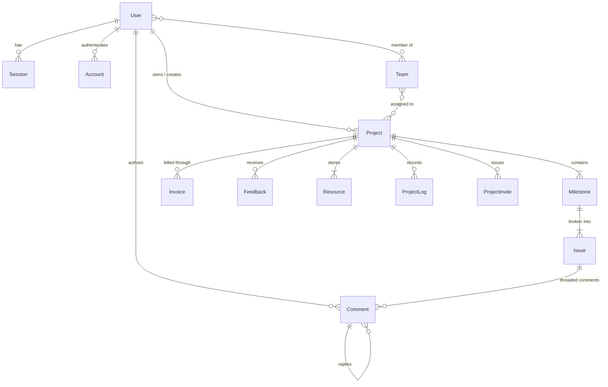

# Entrosync API Specification (Spec-Driven Development)

## 1. Executive Summary & Context

Entrosync is an open-source client portal and project collaboration platform uniting project tracking, milestone delivery, client feedback, invoices, resources, and AI-assisted workflows into a single high-performance monorepo.

`apps/api` is built with **Hono**, **Node.js**, **Prisma ORM**, and **PostgreSQL**, exporting end-to-end typed RPC contracts via `@repo/api-client`. Authentication is governed by **Better Auth** with role-based access control (RBAC), extended by password-gated client portal invite access.

This specification defines the complete REST and RPC endpoint surface, request/response validation schemas, database access patterns, error contracts, authorization rules, and implementation roadmaps.

---

## 2. Architecture & System Design

```mermaid
graph TD
    Client[Web App / Platform / Admin / Mobile] -->|HTTP / JSON & RPC| Hono[apps/api: Hono App]
    Hono -->|Session & RBAC| BetterAuth[Better Auth & Plugins]
    Hono -->|Zod Validation| ZValidator[zValidator Middleware]
    Hono -->|Prisma Pg Adapter| Postgres[(PostgreSQL DB)]
    Hono -->|S3 Presigned URLs / Uploads| Storage[@repo/storage AWS S3 / R2]
    Hono -->|Structured Logging & Traces| Logger[@repo/logger Pino + OTel]
    Hono -->|Async Jobs / Notifications| Worker[@repo/worker BullMQ + Redis]
    Hono -->|Smart AI Briefing| AIModule[OpenAI / LLM Service]
```

### Module Organization in `apps/api/src/modules/`
```
apps/api/src/
├── app.ts
├── config.ts
├── index.ts
├── main.ts
├── modules/
│   ├── ai/               # Smart AI brief parsing & project generator
│   │   ├── router.ts
│   │   ├── schema.ts
│   │   ├── services.ts
│   │   └── types.ts
│   ├── auth/             # Better Auth integration & session middlewares
│   │   ├── auth.ts
│   │   └── middleware.ts
│   ├── comments/         # Issue comments & nested reply threads
│   ├── dashboard/        # Aggregated stats, payouts, and activity feed
│   ├── feedbacks/        # Client reviews and satisfaction ratings
│   ├── invites/          # Client portal invitation tokens & guest auth
│   ├── invoices/         # Invoices, billables, payment status, totals
│   ├── issues/           # Milestone tasks & status lifecycles
│   ├── milestones/       # Project phases, deadlines & progress tracking
│   ├── profile/          # Current user profile updates
│   ├── project-logs/     # Audit activity logs for projects
│   ├── projects/         # Project lifecycle, team membership, slugs
│   ├── resources/        # Project documents, asset links, and S3 uploads
│   └── users/            # User administration and directory
└── utils/
    ├── errors.ts         # Standard domain error classes & handlers
    ├── prisma.ts         # Prisma client singleton
    └── slug.ts           # Slug generators and sanitizers
```

---

## 3. Data Schema & Relationships (Prisma Models)



### Database Enums
- **`ProjectStatus`**: `BACKLOG`, `PLANNED`, `IN_PROGRESS`, `COMPLETED`, `CANCELLED`
- **`IssueStatus`**: `BACKLOG`, `TODO`, `IN_PROGRESS`, `IN_REVIEW`, `DONE`, `CANCELLED`
- **`InvoiceStatus`**: `PENDING`, `PAID`
- **`Currency`**: `IDR`, `USD`
- **`ResourceType`**: `FILE`, `LINK`

---

## 4. Authentication, Authorization & Security

### 4.1. Auth Strategies
1. **Authenticated User Session**: Authenticated via Better Auth cookies / Bearer tokens. Identified via `c.get("user")` and `c.get("session")`.
2. **Admin Role**: `user.role` contains `"admin"`. Required for `/users` administrative operations.
3. **Project Owner / Member**: User is the creator of the project (`userId === project.userId`) or belongs to a `Team` assigned to the project.
4. **Client Portal Guest Token**: Password-gated token (`ProjectInvite`) allowing guest clients scoped read-only access to their specific project, with permissions to submit Feedback and download Invoices/Resources.

### 4.2. Middleware & Context Variables
- `loadAuthSession`: Loads current session/user into Hono context variables.
- `requireAuth`: Guarantees user is authenticated; returns `401 Unauthorized` otherwise.
- `requireAdmin`: Guarantees authenticated user has admin privileges; returns `403 Forbidden` otherwise.
- `requireProjectAccess`: Verifies authenticated user is owner or team member of `:projectId` / `:slug`.

---

## 5. API Module Specifications

### 5.1. Authentication & Session Module (`/api/auth/*` & `/session`)
- `ALL /api/auth/*` — Delegated to `betterAuth.handler(c.req.raw)`.
- `GET /session`
  - **Auth**: Optional / Authenticated.
  - **Response 200**: `{ session: AuthSession, user: AuthUser }`
  - **Response 401**: `{ error: "unauthorized" }`

---

### 5.2. Profile Module (`/profile`)
- `PATCH /profile`
  - **Auth**: Required.
  - **Request Body**:
    ```json
    {
      "name": "string (1..100)",
      "image": "string (url | null, optional)"
    }
    ```
  - **Response 200**: `{ user: { id, name, email, emailVerified, image, role, createdAt, updatedAt } }`
  - **Errors**: `400 Invalid Input`, `401 Unauthorized`

---

### 5.3. Projects Module (`/projects`)

#### `GET /projects`
- **Auth**: Required.
- **Query Params**:
  - `status`: Optional `ProjectStatus | "ALL"` (default: `"ALL"`).
  - `search`: Optional string (search title/slug/clientName).
  - `cursor`: Optional string (pagination cursor ID).
  - `limit`: Optional number (1..50, default: 20).
- **Response 200**:
  ```json
  {
    "items": [
      {
        "id": "string",
        "userId": "string",
        "slug": "string",
        "title": "string",
        "description": "string | null",
        "status": "ProjectStatus",
        "startDate": "string (ISO) | null",
        "targetDate": "string (ISO) | null",
        "createdAt": "string (ISO)",
        "updatedAt": "string (ISO)",
        "progress": 75,
        "milestonesCount": 4,
        "issuesCount": 12,
        "clientName": "string"
      }
    ],
    "nextCursor": "string | null"
  }
  ```

#### `POST /projects`
- **Auth**: Required.
- **Request Body**:
  ```json
  {
    "title": "string (1..200)",
    "slug": "string (optional, auto-generated if omitted)",
    "description": "string (optional)",
    "clientName": "string (optional)",
    "startDate": "string (ISO date, optional)",
    "targetDate": "string (ISO date, optional)",
    "status": "ProjectStatus (optional, default: BACKLOG)"
  }
  ```
- **Response 201**: Created project object.
- **Side Effect**: Automatically creates an entry in `ProjectLog` ("Project created").

#### `GET /projects/:idOrSlug`
- **Auth**: Required (Owner / Team Member / Guest Token Header).
- **Response 200**: Full `ProjectDetail` object with nested milestones, issues, invoices, feedbacks, resources, logs, teams, and invites.
- **Response 404**: `{ error: "project_not_found" }`

#### `PATCH /projects/:id`
- **Auth**: Required (Owner).
- **Request Body**:
  ```json
  {
    "title": "string (optional)",
    "slug": "string (optional)",
    "description": "string | null (optional)",
    "status": "ProjectStatus (optional)",
    "startDate": "string (ISO date) | null (optional)",
    "targetDate": "string (ISO date) | null (optional)"
  }
  ```
- **Response 200**: Updated project object.
- **Side Effect**: Logs action in `ProjectLog`.

#### `DELETE /projects/:id`
- **Auth**: Required (Owner).
- **Response 200**: `{ success: true, id: "string" }`

---

### 5.4. Milestones Module (`/milestones` & `/projects/:projectId/milestones`)

#### `GET /projects/:projectId/milestones`
- **Auth**: Required.
- **Response 200**: List of milestones with nested issues.

#### `POST /projects/:projectId/milestones`
- **Auth**: Required.
- **Request Body**:
  ```json
  {
    "title": "string (1..200)",
    "description": "string (optional)",
    "startDate": "string (ISO date, optional)",
    "targetDate": "string (ISO date, optional)"
  }
  ```
- **Response 201**: Created Milestone object.
- **Side Effect**: Logs "Milestone created" in `ProjectLog`.

#### `PATCH /milestones/:id`
- **Auth**: Required.
- **Request Body**:
  ```json
  {
    "title": "string (optional)",
    "description": "string | null (optional)",
    "progress": "number (0..100, optional)",
    "startDate": "string (ISO date) | null (optional)",
    "targetDate": "string (ISO date) | null (optional)"
  }
  ```
- **Response 200**: Updated Milestone.
- **Side Effect**: Recalculates milestone/project aggregate progress and logs status change if progress reached 100%.

#### `DELETE /milestones/:id`
- **Auth**: Required.
- **Response 200**: `{ success: true, id: "string" }`

---

### 5.5. Issues / Tasks Module (`/issues` & `/milestones/:milestoneId/issues`)

#### `GET /milestones/:milestoneId/issues`
- **Auth**: Required.
- **Response 200**: List of `IssueItem` with comments.

#### `POST /milestones/:milestoneId/issues`
- **Auth**: Required.
- **Request Body**:
  ```json
  {
    "title": "string (1..200)",
    "description": "string (optional)",
    "status": "IssueStatus (default: BACKLOG)",
    "startDate": "string (ISO date, optional)",
    "targetDate": "string (ISO date, optional)"
  }
  ```
- **Response 201**: Created Issue.

#### `PATCH /issues/:id`
- **Auth**: Required.
- **Request Body**:
  ```json
  {
    "title": "string (optional)",
    "description": "string | null (optional)",
    "status": "IssueStatus (optional)",
    "milestoneId": "string (optional, moves issue between milestones)",
    "startDate": "string (ISO date) | null (optional)",
    "targetDate": "string (ISO date) | null (optional)"
  }
  ```
- **Response 200**: Updated Issue.
- **Side Effect**: If status changed, automatically updates milestone progress and logs action in `ProjectLog`.

#### `DELETE /issues/:id`
- **Auth**: Required.
- **Response 200**: `{ success: true, id: "string" }`

---

### 5.6. Threaded Comments Module (`/comments` & `/issues/:issueId/comments`)

#### `GET /issues/:issueId/comments`
- **Auth**: Required.
- **Response 200**: Hierarchical comment tree with `replies`.

#### `POST /issues/:issueId/comments`
- **Auth**: Required.
- **Request Body**:
  ```json
  {
    "content": "string (1..5000)",
    "parentId": "string (optional, for nested replies)"
  }
  ```
- **Response 201**: Created `CommentItem` with author profile details.

#### `PATCH /comments/:id`
- **Auth**: Required (Author only).
- **Request Body**: `{ "content": "string (1..5000)" }`
- **Response 200**: Updated comment.

#### `DELETE /comments/:id`
- **Auth**: Required (Author or Project Owner).
- **Response 200**: `{ success: true, id: "string" }`

---

### 5.7. Invoices Module (`/invoices` & `/projects/:projectId/invoices`)

#### `GET /invoices`
- **Auth**: Required.
- **Query Params**: `status`, `projectId`, `limit`, `cursor`.
- **Response 200**: List of all invoices belonging to user's projects.

#### `POST /projects/:projectId/invoices`
- **Auth**: Required.
- **Request Body**:
  ```json
  {
    "amount": "number (positive)",
    "currency": "Currency (default: IDR)",
    "status": "InvoiceStatus (default: PENDING)",
    "description": "string (optional)",
    "paymentMethod": "string (optional)",
    "paymentLink": "string (url, optional)",
    "invoiceNote": "string (optional)",
    "issuedDate": "string (ISO date, optional)",
    "dueDate": "string (ISO date, optional)"
  }
  ```
- **Response 201**: Created `Invoice`.
- **Side Effect**: Logs "Invoice issued" in `ProjectLog`.

#### `PATCH /invoices/:id`
- **Auth**: Required.
- **Request Body**:
  ```json
  {
    "amount": "number (optional)",
    "currency": "Currency (optional)",
    "status": "InvoiceStatus (optional)",
    "description": "string | null (optional)",
    "paymentMethod": "string | null (optional)",
    "paymentLink": "string | null (optional)",
    "invoiceNote": "string | null (optional)",
    "issuedDate": "string (ISO date) | null (optional)",
    "dueDate": "string (ISO date) | null (optional)"
  }
  ```
- **Response 200**: Updated `Invoice`.
- **Side Effect**: If status changed to `PAID`, logs "Invoice paid" in `ProjectLog`.

#### `DELETE /invoices/:id`
- **Auth**: Required.
- **Response 200**: `{ success: true, id: "string" }`

---

### 5.8. Feedbacks Module (`/feedbacks` & `/projects/:projectId/feedbacks`)

#### `GET /projects/:projectId/feedbacks`
- **Auth**: Required (Owner, Team Member, or Guest with project invite).
- **Response 200**: List of feedbacks.

#### `POST /projects/:projectId/feedbacks`
- **Auth**: Required (Owner, Team Member, or Guest with verified invite token).
- **Request Body**:
  ```json
  {
    "title": "string (1..200)",
    "description": "string (optional)",
    "rating": "number (1..5, optional)"
  }
  ```
- **Response 201**: Created `Feedback`.
- **Side Effect**: Logs "Feedback submitted" in `ProjectLog`.

#### `DELETE /feedbacks/:id`
- **Auth**: Required (Owner).
- **Response 200**: `{ success: true, id: "string" }`

---

### 5.9. Resources & Storage Module (`/resources` & `/projects/:projectId/resources`)

#### `GET /projects/:projectId/resources`
- **Auth**: Required.
- **Response 200**: List of `ResourceItem`.

#### `POST /projects/:projectId/resources`
- **Auth**: Required.
- **Request Body**:
  ```json
  {
    "title": "string (1..200)",
    "type": "ResourceType (FILE | LINK)",
    "url": "string (url, optional)",
    "content": "string (optional)"
  }
  ```
- **Response 201**: Created Resource.
- **Side Effect**: Logs "Resource added" in `ProjectLog`.

#### `POST /resources/upload-url`
- **Auth**: Required.
- **Request Body**:
  ```json
  {
    "projectId": "string",
    "filename": "string",
    "contentType": "string",
    "fileSize": "number (max 50MB)"
  }
  ```
- **Response 200**:
  ```json
  {
    "uploadUrl": "string (Presigned S3 PUT URL)",
    "fileUrl": "string (Public or download URL)",
    "key": "string"
  }
  ```

#### `DELETE /resources/:id`
- **Auth**: Required.
- **Response 200**: `{ success: true, id: "string" }`

---

### 5.10. Project Activity Logs Module (`/projects/:projectId/logs` & `/dashboard/activity`)

#### `GET /projects/:projectId/logs`
- **Auth**: Required.
- **Response 200**: Array of `ProjectLogItem` sorted by `createdAt DESC`.

#### `GET /dashboard/activity`
- **Auth**: Required.
- **Query Params**: `limit` (default: 10).
- **Response 200**: Array of recent activity feed entries across all user's projects.

---

### 5.11. Client Portal Invites & Guest Access (`/invites`)

#### `POST /projects/:projectId/invites`
- **Auth**: Required (Owner).
- **Request Body**:
  ```json
  {
    "clientName": "string",
    "email": "string (email)",
    "password": "string (min 6 chars)",
    "expiresInDays": "number (default: 30)"
  }
  ```
- **Response 201**: Created `ProjectInviteItem` with access token & shareable invite URL.

#### `POST /invites/verify`
- **Auth**: Public / Guest.
- **Request Body**:
  ```json
  {
    "token": "string",
    "password": "string"
  }
  ```
- **Response 200**:
  ```json
  {
    "valid": true,
    "accessToken": "string (Guest JWT or Session)",
    "projectId": "string",
    "projectSlug": "string",
    "clientName": "string"
  }
  ```
- **Side Effect**: Updates `accessedAt` timestamp and logs "Invite accepted" in `ProjectLog`.

#### `GET /guest/projects/:token`
- **Auth**: Guest Access (Verified invite token).
- **Response 200**: Client-filtered `ProjectDetail` view (excludes internal sensitive freelancer notes/rates if flagged).

---

### 5.12. Dashboard Summaries & Metrics (`/dashboard`)

#### `GET /dashboard/stats`
- **Auth**: Required.
- **Response 200**:
  ```json
  {
    "totalRevenueYtd": 17050000,
    "revenueGrowthPercent": 18.4,
    "activeProjectsCount": 4,
    "milestonesThisWeekCount": 2,
    "pendingInvoicesCount": 3,
    "pendingAmount": 9500000
  }
  ```

#### `GET /dashboard/projects`
- **Auth**: Required.
- **Response 200**: List of `DashboardProject` items with progress percentages and deadlines.

#### `GET /dashboard/payouts`
- **Auth**: Required.
- **Response 200**: List of `DashboardPayout` items (pending and recent paid payouts).

---

### 5.13. Smart AI Brief Integration (`/ai`)

#### `POST /ai/generate-brief`
- **Auth**: Required.
- **Request Body**:
  ```json
  {
    "rawText": "string (min 20, max 20000 chars, e.g. messy WhatsApp / Slack client chat)"
  }
  ```
- **Response 200**:
  ```json
  {
    "title": "string",
    "clientName": "string",
    "summary": "string",
    "proposal": "string",
    "scopeOfWork": [
      {
        "milestoneTitle": "string",
        "description": "string",
        "suggestedDays": 7,
        "tasks": ["string", "string"]
      }
    ]
  }
  ```

#### `POST /ai/convert-to-project`
- **Auth**: Required.
- **Request Body**: AI brief output payload with optional overrides.
- **Response 201**: Creates new `Project`, automatically creates all `Milestone` and `Issue` records in a single Prisma transaction, and returns the full `ProjectDetail`.

---

## 6. End-to-End Type Safety & `@repo/api-client`

`apps/api/src/app.ts` exports `AppType`, composed of all chained route definitions:
```ts
export const app = new Hono<{ Variables: AuthVariables }>()
  .use("*", cors(...))
  .use("*", loadAuthSession)
  .route("/profile", profileRouter)
  .route("/users", usersRouter)
  .route("/projects", projectsRouter)
  .route("/milestones", milestonesRouter)
  .route("/issues", issuesRouter)
  .route("/comments", commentsRouter)
  .route("/invoices", invoicesRouter)
  .route("/feedbacks", feedbacksRouter)
  .route("/resources", resourcesRouter)
  .route("/dashboard", dashboardRouter)
  .route("/invites", invitesRouter)
  .route("/guest", guestRouter)
  .route("/ai", aiRouter);

export type AppType = typeof app;
```

`packages/api-client` exports `createApiClient(baseUrl)` leveraging `hc<AppType>` for zero-overhead, strictly-typed auto-completion across `apps/platform` and `apps/admin`.

---

## 7. Error Handling & Standard Error Codes

All standard error responses conform to:
```json
{
  "error": "string_code",
  "message": "Human readable error description",
  "details": null
}
```

| HTTP Status | Error Code | Scenario |
| :--- | :--- | :--- |
| `400` | `invalid_input` / `validation_error` | Zod schema validation failed on body/query/params |
| `400` | `invalid_cursor` | Cursor-based pagination string is corrupted |
| `401` | `unauthorized` | Missing or invalid auth cookie / session / token |
| `403` | `forbidden` | User is not project owner / lack of permissions / non-admin |
| `404` | `not_found` | Project, milestone, issue, or invoice does not exist |
| `409` | `conflict` / `slug_exists` | Project slug or unique token collision |
| `500` | `internal_server_error` | Unhandled database or external service failure |

---

## 8. Verification & Test Plan

Each module will contain unit and integration tests under `*.test.ts`:
- **Schema Validation Tests**: Edge case testing for payload sanitization, date parsing, and URL formatting.
- **Service Layer Tests**: Database operations mocking Prisma client or running against isolated test PostgreSQL.
- **Router Integration Tests**: Using `app.request()` to test full HTTP lifecycle, status codes, and auth guards.
- **Type Checking**: `pnpm typecheck` to verify complete type harmony between `apps/api` and `@repo/api-client`.
